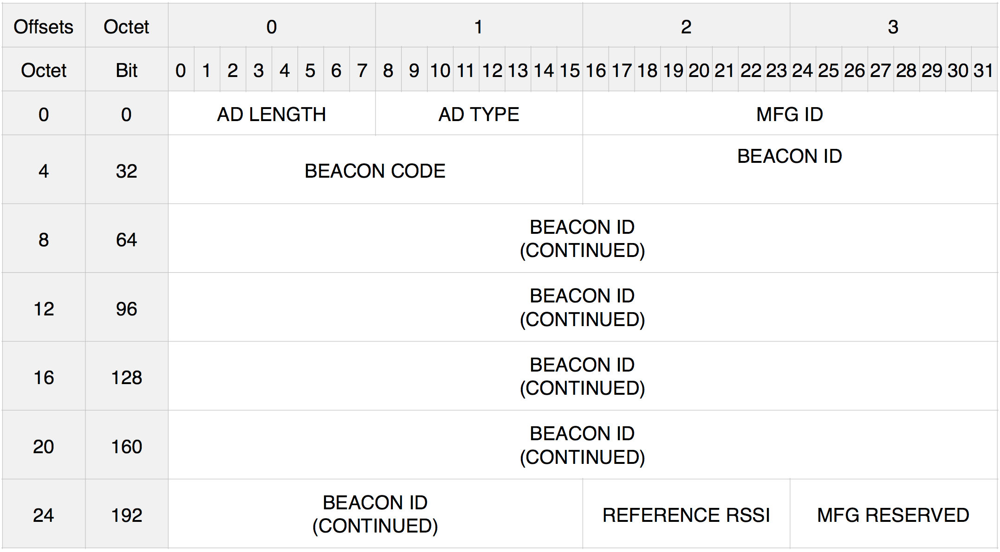

# AltBeacon Protocol Specification v1.0

AltBeacon is a protocol specification that defines a message format for proximity beacon advertisements. AltBeacon proximity beacon advertisements are transmitted by devices for the purpose of signaling their proximity to nearby receivers. The contents of the emitted message contains information that the receiving device can use to identify the beacon and to compute its relative distance to the beacon. The receiving device may uses this information as a contextual trigger to execute procedures and implement behaviors that are relevant to being in proximity to the transmitting beacon.

Example use cases for proximity beacons include but are not limited to:

* Notifying users of special offers as they visit areas within a department store
* Presenting opportunities to explore additional information about an exhibit to a museum visitor
* Automatically checking a customer in a customer with a restaurants reservation system as the customer arrives at the restaurant

## Design Goals

The development of the AltBeacon specification has been driven by several objectives:

1. Provide a concise proximity advertising message for interchange of proximity information between advertisers and scanners.
1. Maintain compliance with Bluetooth Specification Version 4.0 by utilizing defined advertising PDU and and advertising types.
1. Encourage adoption by all interested parties by avoiding any obvious implementation limitations.
1. Enable the implementation for vendor-specific features if possible.

## Implementation Requirements

Proximity beacon functionality is not limited to single function devices, but can be incorporated as a feature of any device that is Bluetooth Low Energy compliant and which conforms to the requirements defined in _Bluetooth Specification Version 4.0, Volume 0, Part B, Section 4.4 Low Energy Core Configuration or Section 4.5 Basic Rate and Low Energy Combined Core Configuration_.

AltBeacon advertisements are encapsulated as the payload of a non connectable undirected advertising `PDU` (`ADV_NONCONN_IND`) as defined in _Bluetooth Specification Version 4.0, Volume 6, Part B, Section 2.3 Advertising Channel PDU_.

Devices that transmit proximity beacon advertisement packets are referred to as advertisers. Devices that receive proximity beacon advertisements are referred to as scanners. These roles follow the conventions defined in _Bluetooth Specification Version 4.0, Volume 1, Section 1.2 Overview of Bluetooth Low Energy Operation_.

## AltBeacon Protocol Format

The AltBeacon advertisement makes use of the Manufacturer Specific Advertising Data structure as defined in _Bluetooth Specification Version 4.0, Volume 3, Part C, Section 2.3 Advertising Channel PDU_.

The AltBeacon advertisement is made up of a 1-byte length field, 1-byte type field and two-byte company identifier, as prescribed by the Manufacturer Specific Advertising Data structure format, followed by 24 additional bytes containing the beacon advertisement data.

See the AltBeacon Protocol Data and AltBeacon Protocol Fields as described below for information on the specific fields, their descriptions and accepted values.

## AltBeacon Protocol Diagram

## AltBeacon Protocol Fields

Field Name               |  Description                                                                                 | Accepted Values
------------------------ | -------------------------------------------------------------------------------------------- | ---------------
AD LENGTH [MFG SPECIFIC] | Length of the type and data portion of the Manufacturer Specific advertising data structure. | 0x1B
AD TYPE [MFG SPECIFIC]   | Type representing the Flags advertising data structure.                                      | 0xFF
MFG ID                   | The beacon device manufacturer’s company identifier code.                                    | The little endian representation of the beacon device manufacturer’s company code as maintained by the Bluetooth SIG assigned numbers database.
BEACON ADV CODE          | The AltBeacon advertisement code.                                                            | 0xBEAC
BEACON ID                | A 20-byte value uniquely identifying the beacon.                                             | The big endian representation of the beacon identifier
REFERENCE RSSI           | A 1-byte value representing the average received signal strength at 1m from the advertiser.  | A signed 1-byte value from 0 to -127
MFG RESERVED             | Reserved for use by the manufacturer to implement special features.                          | A 1-byte value from 0x00 to 0xFF. Interpretation of this value is to be defined by the manufacturer and is to be evaluated based on the MFG IDENTIFIER value.

